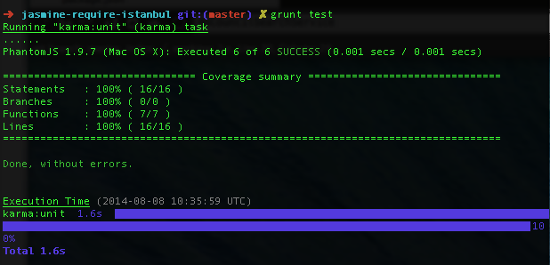

========================
#Jasmine Require Istanbul Starter 
========================

A skeleton starter project for Grunt, Karma, Jasmine and Istanbul for code coverage

=========

> Jasmine Require Istanbul Starter is jump off point for creating frontend projects with jasmine and require.js with built in code coverage reporting.

## Installation

This template uses Jasmine 2.x

Clone this repository and from a terminal type

```
npm install
```

Now you can run your unit tests

```
grunt test
```

You should see this  



##How it works

```javascript

module.exports = function(grunt) {
    'use strict';

    require('load-grunt-tasks')(grunt);

    // Time the tasks
    require('time-grunt')(grunt);

    // Project configuration.
    grunt.initConfig({

        karma: {
            unit: {
                configFile: 'test/karma.conf.js'
            }
        }

    });

    grunt.registerTask('test', [
        'karma'
    ]);

};
```

The gruntfile has a single task - test. This task runs karma which gets its configuration from an external file called karma.conf.js in the test folder.

If we had wanted, we could have put all the configuration for karma within gruntfile.js, but I like to keep gruntfile.js as clean as possible.

Our karma.conf.js file looks like this

```javascript
// Karma configuration
// Generated on Fri Jul 04 2014 14:00:10 GMT+0100 (BST)

module.exports = function(config) {
    config.set({

        // base path that will be used to resolve all patterns (eg. files, exclude)
        basePath: '../',


        // frameworks to use
        // available frameworks: https://npmjs.org/browse/keyword/karma-adapter
        frameworks: ['jasmine', 'requirejs'],


        // list of files / patterns to load in the browser
        files: [{
                pattern: 'test/unit/*.js',
                included: false
            }, {
                pattern: 'app/**/*.js',
                included: false
            },
            'test/test-main.js'
        ],

        // list of files to exclude
        exclude: ['app/js/main.js'],

        // test results reporter to use
        // possible values: 'dots', 'progress'
        // available reporters: https://npmjs.org/browse/keyword/karma-reporter
        reporters: ['dots', 'coverage'],

        // preprocess matching files before serving them to the browser
        // available preprocessors: https://npmjs.org/browse/keyword/karma-preprocessor
        preprocessors: {
            // source files, that you wanna generate coverage for
            // do not include tests or libraries
            // (these files will be instrumented by Istanbul)
            'app/js/*.js': ['coverage']
            //'app/scripts/aquilla/ContentNode.js': ['coverage']
            //'app/scripts/aquilla/ContentNodeInterface.js': ['coverage']
        },

        // optionally, configure the reporter
        coverageReporter: {
            reporters: [{
                    type: 'html',
                    dir: 'coverage/'
                }, {
                    type: 'json',
                    dir: 'coverage/'
                }, {
                    type: 'lcov',
                    dir: 'coverage/'
                }, {
                    type: 'cobertura',
                    dir: 'coverage/',
                    file: 'cobertura.xml'
                } //, {
                //   type: 'teamcity'
                //}
                , {
                    type: 'text-summary'
                }
            ]
        },

        // web server port
        port: 9876,

        // level of logging
        // possible values: config.LOG_DISABLE || config.LOG_ERROR || config.LOG_WARN || config.LOG_INFO || config.LOG_DEBUG
        logLevel: config.LOG_ERROR,

        // enable / disable colors in the output (reporters and logs)
        colors: true,

        // enable / disable watching file and executing tests whenever any file changes
        autoWatch: true,

        // start these browsers
        // available browser launchers: https://npmjs.org/browse/keyword/karma-launcher
        browsers: ['PhantomJS'],

        // Continuous Integration mode
        // if true, Karma captures browsers, runs the tests and exits
        singleRun: true
    });
};
```

Lets go through all the options and explain what they do.

```javascript
basePath: '../',
```
Because this config file resides in our test folder, if we want to start all our paths from the root of the project, we need to set the base to be in the parent directory.

```javascript
frameworks: ['jasmine', 'requirejs'],
```
We want to use jasmine for our testing, and we want to use require.js to load modules within our jasmine tests.
We can use requirejs here because our package.json contains grunt-contrib-requirejs. If it didn't then we would get an error that require is not recognised. But you dont have to worry about that one.

```javascript
files: [{
        pattern: 'test/unit/*.js',
        included: false
    }, {
        pattern: 'app/**/*.js',
        included: false
    },
    'test/test-main.js'
],
```
Under files, we list all our javascript files in our project that contain either code that we are testing or actual unit test files. It doesnt matter what order you list them in here. We also want to reference the test-main.js file. Karma recognises this file as a require.js config file and uses it to pull all the test/spec files out and add them to the tests after all the source js files have been loaded. Does that make sense? Hope so. If not, then just follow this pattern, it'll sink in after you;ve used it a few times in different projects.

```javascript
exclude: ['app/js/main.js'],
```
Our test suite has its own require.js main file, so ignore the apps one, so that we dont have any conflicts.
You will have to replicate the main.js file configuration (paths, sims etc) in the test-main.js file. This will cause a some duplication so ermember to update test-main.js when you alter the main.js file.

```javascript
reporters: ['dots', 'coverage'],
```
When we type grunt test, the output that we see in the terminal has a green or red dot for every test ran.
We also want the tests to be reported with the istanbul code coverage tool, so we list 'coverage' here too.

```javascript
preprocessors: {
    'app/js/*.js': ['coverage']
},
```
source files, that you wanna generate coverage for
do not include tests or libraries
(these files will be instrumented by Istanbul)

```javascript
coverageReporter: {
    reporters: [{
            type: 'html',
            dir: 'coverage/'
        }, {
            type: 'json',
            dir: 'coverage/'
        }, {
            type: 'lcov',
            dir: 'coverage/'
        }, {
            type: 'cobertura',
            dir: 'coverage/',
            file: 'cobertura.xml'
        } //, {
        //   type: 'teamcity'
        //}
        , {
            type: 'text-summary'
        }
    ]
},
```
We can choose to output out coverage reports in lots of different ways. In this example, all the reports will end up oin the coverage folder, but you can chnage this in the code above to send it to different folders if you like. Personally, I prefer to keep them all together.

The html reported is excellent and gives you a nice web page showing the coverage for all the files you chose to be tested with full drill down to the actual file which will be marked up in green and red to show which lines are covered by your tests and which are not.

```javascript
port: 9876,
```
Karma starts its own web server on this port. The jasmine unit tests are actually run on the browser and a code coverage report is generated for each browser listed in the 'browers' section in the karma.conf.js file.

```javascript
logLevel: config.LOG_ERROR,
```
You can choose LOG_DEBUG here to see where it all went wrong.

```javascript
colors: true,
```
Who doesn't like some nice coloured output on their terminal window.

```javascript
autoWatch: true,
```
If we we to alter this file to singleRun::false then autoWatch makes sure that whwnever a js module or a test is modififed, that the full test suite is ru nagain. This is fantastic for tdd development.


```javascript
browsers: ['PhantomJS'],
```
Out tests are run in the PhantomJS browser which uses the Chrome V8 engine. Its sorta like chrome, but without the GUI. You can add Chrome, Safari, Firefox in here if you like as long as you included them in the package json file.

You can easily do this by running
```javascript
npm install karma-chrome-launcher --save-dev
```
from a terminal window. then you could change browsers to
```javascript
browsers: ['PhantomJS','Chrome'],
```
If you do this, then you will see the chrome browser opening automatically and navigating to localhost:9876 and automatically run the tests, reporting the results back to the terminal window, and creating a new sub flder for chrome under coverage.


```javascript
singleRun: true
```
When we type Grunt test, it does a ingle pass of our tests then exits to the terminal window.
If we change this to false, then the terminal will not closse and karma will constantly monitor out code and testsand rerun the tests whenever a change is made. This is great for TDD.

###Goodbye
Please raise an issue if you find any problems, otherwise enjoy...

Mark
